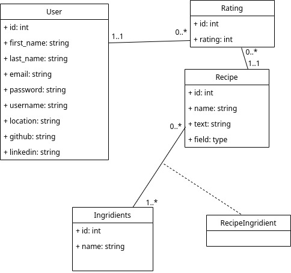
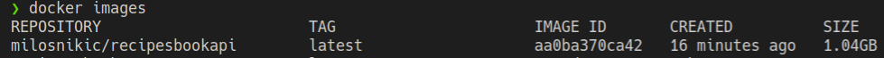
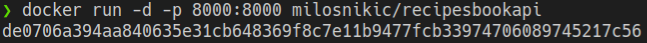
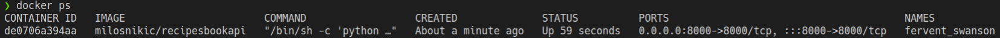

# Recipes book

## Short description
Create recipes book using Django and Django REST Framework.

## Model class diagram


## Prerequisites
You must have [docker](https://docs.docker.com/get-docker/) installed on your machine.

## User requirements
- [x] User should at least have email, first name, and last name
- [x] Recipe should have a name, recipe text, and ingredients
- [x] Ingredient should have a name
- [x] Rating is number between 1 and 5
- [x] When listing recipes, return an average rating for each recipe.
- [x] Use hunter for verifying email existence on registration
- [x] Use clearbit for getting additional data for the user
- [x] Use JWT for user authentication
- [x] The solution should be posted on any source control

## Basic features
- [x] User registration
- [x] User login
- [x] Recipe creation
- [x] Recipe Rating (you cannot rate your own recipes)
- [x] List all recipes
- [x] List own recipes
- [x] Get most used ingridients (top5)
- [x] Neptune
- [x] Comet Haley

## Bonus
- [x] Dockerized solution is a plus
- [ ] Unit tests are a plus
- [x] Search recipes (name, text, ingredients) is a plus
- [x] Filter recipes with minimum and maximum number of ingredients is a plus

## Docker installation
First thing you want to do is to pull docker image with next command:
```
docker pull milosnikic/recipesbookapi
```

After that run

```
docker ps
```
to verify that image has been successfully pulled.



```
docker run -d -p 8000:8000 milosnikic/recipesbookapi
```
After that, container should be successfully created.



You can verify that by running
```
docker ps
```

to see running containers



And now you can verify that application is started with visiting [localhost](http://localhost:8000/admin) and login with credentials (test, Test)
